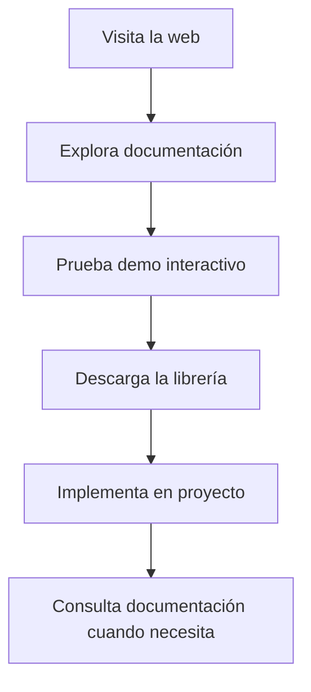

# JRQuery - Documento de Requisitos del Producto

## 1. Descripción General del Producto

JRQuery es una librería JavaScript ligera inspirada en jQuery que permite la manipulación del DOM y manejo de eventos usando JavaScript puro. Proporciona una sintaxis familiar y poderosa para desarrolladores que necesitan funcionalidades similares a jQuery sin la dependencia de una librería externa pesada.

El producto está dirigido a desarrolladores web que buscan:
- Una alternativa moderna y ligera a jQuery
- Sintaxis familiar y fácil de aprender
- Rendimiento optimizado con JavaScript vanilla
- Compatibilidad con navegadores modernos
- Tamaño de archivo mínimo

## 2. Características Principales

### 2.1 Funcionalidades Core

**Selector Engine**
- Soporte para selectores CSS básicos: ID (#), clase (.), y etiquetas
- Selección múltiple de elementos
- Chaining de métodos fluido

**Manipulación del DOM**
- Agregar/remover clases CSS
- Modificar contenido HTML y texto
- Manipular atributos y datos
- Aplicar estilos CSS inline

**Sistema de Eventos**
- Manejo de eventos con sintaxis `.on()`
- Soporte para múltiples tipos de eventos
- Delegación de eventos
- Remoción de event listeners

**Animaciones**
- Fade in/out con duración configurable
- Slide up/down suaves
- Animaciones basadas en CSS para mejor rendimiento

**Utilidades**
- Iteración sobre elementos con `.each()`
- Mapeo de elementos con `.map()`
- Navegación DOM: `.find()`, `.parent()`, `.children()`

### 2.2 Características Técnicas

| Característica | Especificación |
|----------------|----------------|
| Tamaño objetivo | < 50KB minificado |
| Compatibilidad | IE11+, Chrome, Firefox, Safari, Edge |
| Dependencias | Ninguna (JavaScript puro) |
| Rendimiento | < 1ms tiempo de inicialización |
| API | Compatible con patrones jQuery |

## 3. Páginas y Módulos del Producto

### 3.1 Demo y Documentación Web

1. **Página Principal**: Presentación de la librería, características y beneficios
2. **Documentación**: Guía completa de uso con ejemplos
3. **Demo Interactivo**: Playground para probar la librería en tiempo real
4. **Página de Descarga**: Links para descargar la librería

### 3.2 Estructura de la Documentación

| Página | Módulo | Descripción |
|--------|---------|-------------|
| Home | Hero Section | Presentación principal con código de ejemplo |
| Home | Características | Lista de funcionalidades principales |
| Home | Comparación | Tabla comparativa con jQuery |
| Documentación | Guía Rápida | Introducción básica al uso |
| Documentación | API Reference | Documentación completa de todos los métodos |
| Documentación | Ejemplos | Casos de uso comunes con código |
| Demo | Playground | Editor interactivo para probar código |
| Demo | Ejemplos Predefinidos | Lista de ejemplos ejecutables |

## 4. Flujo de Usuario

### 4.1 Flujo de Desarrollador



### 4.2 Flujo de Uso de la Librería

```mermaid
graph TD
    A[Incluir JRQuery en HTML] --> B[Usar $ para seleccionar elementos]
    B --> C[Aplicar métodos de manipulación]
    C --> D[Encadenar múltiples operaciones]
    D --> E[Manejar eventos con .on()]
```

## 5. Diseño de Interfaz

### 5.1 Estilo Visual de la Documentación

**Colores Principales**
- Color primario: #007ACC (Azul jQuery)
- Color secundario: #333333 (Gris oscuro)
- Color de acento: #00D4AA (Verde turquesa)
- Fondo: #FFFFFF
- Texto: #333333

**Tipografía**
- Fuente principal: 'Monaco', 'Menlo', 'Ubuntu Mono', monospace
- Títulos: 'Helvetica Neue', sans-serif
- Tamaños: 16px para código, 18px para texto normal

**Estilo de Código**
- Sintaxis highlighting con temas oscuros
- Bloques de código con copy-to-clipboard
- Ejemplos interactivos con resultado en vivo

### 5.2 Elementos de UI

| Componente | Estilo | Descripción |
|------------|---------|-------------|
| Navbar | Fixed top, minimal | Navegación principal |
| Hero Section | Full height, centered | Presentación impactante |
| Code Blocks | Dark theme, syntax highlight | Mostrar ejemplos de código |
| Demo Playground | Split view (editor/result) | Editor interactivo |
| API Cards | Grid layout, card-based | Documentación de métodos |

### 5.3 Responsive Design

- **Desktop-first**: Diseño optimizado para pantallas grandes
- **Mobile adaptive**: Adaptación para tablets y móviles
- **Breakpoints**: 768px, 1024px, 1440px
- **Touch optimization**: Botones y enlaces adaptados para touch

## 6. Requisitos No Funcionales

### 6.1 Rendimiento
- Tiempo de cuego de la librería: < 50ms
- Tiempo de ejecución de métodos básicos: < 1ms
- Uso de memoria: < 5MB para operaciones comunes
- Sin bloqueo del hilo principal en animaciones

### 6.2 Compatibilidad
- Navegadores modernos (últimas 2 versiones)
- IE11 con polyfills opcionales
- Soporte para módulos ES6 y CommonJS
- Compatible con bundlers (Webpack, Rollup, Parcel)

### 6.3 Accesibilidad
- Documentación con buena estructura semántica
- Ejemplos incluyendo prácticas de accesibilidad
- Contraste de color WCAG 2.1 AA
- Navegación por teclado completa

## 7. Casos de Uso Principales

### 7.1 Manipulación Básica del DOM
```javascript
// Agregar clase a elementos
$('.item').addClass('active');

// Modificar contenido
$('#title').text('Nuevo título');
$('#content').html('<p>Nuevo contenido</p>');

// Manejar eventos
$('#button').on('click', function() {
    $(this).toggleClass('pressed');
});
```

### 7.2 Animaciones y Efectos
```javascript
// Mostrar elemento con fade
$('#modal').fadeIn(300);

// Ocultar con slide
$('#menu').slideUp(200);

// Combinar efectos
$('#alert').fadeIn(100).delay(2000).fadeOut(100);
```

### 7.3 Iteración y Filtrado
```javascript
// Iterar sobre elementos
$('.item').each(function(index, element) {
    $(element).data('index', index);
});

// Encontrar elementos hijos
$('#container').find('.child').addClass('found');
```

## 8. Entregables del Proyecto

### 8.1 Librería
- `jrquery.js` - Versión desarrollo con comentarios
- `jrquery.min.js` - Versión minificada para producción
- Source maps para debugging

### 8.2 Documentación
- Sitio web completo con documentación
- README con instalación y uso básico
- Ejemplos de código comentados
- API reference detallada

### 8.3 Testing
- Suite de tests unitarios
- Tests de integración
- Tests de rendimiento
- Ejemplos de casos de uso

Este documento establece los requisitos fundamentales para crear una librería JRQuery que sea útil, eficiente y fácil de usar para desarrolladores web modernos.