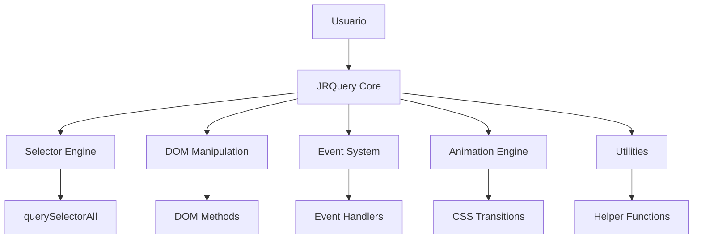

# JRQuery - Arquitectura Técnica

## 1. Arquitectura de la Librería

### 1.1 Diseño General



### 1.2 Estructura Interna

La librería sigue un patrón de diseño modular con los siguientes componentes principales:

1. **JRQuery Core**: Objeto principal que maneja la inicialización y el chaining
2. **Selector Engine**: Parser de selectores CSS y obtención de elementos
3. **DOM Manipulation**: Métodos para modificar el DOM
4. **Event System**: Gestión de eventos con delegación
5. **Animation Engine**: Sistema de animaciones basado en CSS
6. **Utilities**: Funciones auxiliares y helpers

## 2. API Pública

### 2.1 Función Principal

```javascript
// Función global $ para selección de elementos
function $(selector) {
    return new JRQuery(selector);
}

// Constructor JRQuery
class JRQuery {
    constructor(selector) {
        this.elements = this.parseSelector(selector);
        this.length = this.elements.length;
    }
}
```

### 2.2 Métodos de Selección y Manipulación

| Método                    | Descripción                  | Ejemplo                          |
| ------------------------- | ---------------------------- | -------------------------------- |
| `$(selector)`             | Selección de elementos       | `$('#id')`, `$('.class')`        |
| `.on(event, handler)`     | Agregar event listener       | `$('#btn').on('click', fn)`      |
| `.addClass(className)`    | Agregar clase CSS            | `$('div').addClass('active')`    |
| `.removeClass(className)` | Remover clase CSS            | `$('div').removeClass('active')` |
| `.toggleClass(className)` | Alternar clase CSS           | `$('div').toggleClass('active')` |
| `.html(content)`          | Obtener/establecer HTML      | `$('div').html('<p>Text</p>')`   |
| `.text(content)`          | Obtener/establecer texto     | `$('div').text('Hello')`         |
| `.css(property, value)`   | Establecer estilos           | `$('div').css('color', 'red')`   |
| `.attr(name, value)`      | Obtener/establecer atributos | `$('img').attr('src', 'url')`    |
| `.data(key, value)`       | Almacenar datos              | `$('div').data('key', 'value')`  |

### 2.3 Métodos de Animación

| Método                 | Descripción           | Ejemplo                   |
| ---------------------- | --------------------- | ------------------------- |
| `.fadeIn(duration)`    | Mostrar con fade      | `$('div').fadeIn(300)`    |
| `.fadeOut(duration)`   | Ocultar con fade      | `$('div').fadeOut(300)`   |
| `.slideUp(duration)`   | Deslizar hacia arriba | `$('div').slideUp(300)`   |
| `.slideDown(duration)` | Deslizar hacia abajo  | `$('div').slideDown(300)` |

### 2.4 Métodos de Utilidad

| Método            | Descripción          | Ejemplo                          |
| ----------------- | -------------------- | -------------------------------- |
| `.each(callback)` | Iterar elementos     | `$('div').each((i, el) => {})`   |
| `.map(callback)`  | Mapear elementos     | `$('div').map((i, el) => el.id)` |
| `.find(selector)` | Buscar descendientes | `$('div').find('p')`             |
| `.parent()`       | Obtener padre        | `$('div').parent()`              |
| `.children()`     | Obtener hijos        | `$('div').children()`            |

## 3. Implementación Detallada

### 3.1 Selector Engine

```javascript
parseSelector(selector) {
    if (typeof selector === 'string') {
        if (selector.startsWith('#')) {
            // ID selector
            const element = document.getElementById(selector.slice(1));
            return element ? [element] : [];
        } else if (selector.startsWith('.')) {
            // Class selector
            return Array.from(document.getElementsByClassName(selector.slice(1)));
        } else {
            // Tag selector
            return Array.from(document.querySelectorAll(selector));
        }
    } else if (selector instanceof Element) {
        return [selector];
    }
    return [];
}
```

### 3.2 Sistema de Eventos

```javascript
on(event, handler) {
    this.elements.forEach(element => {
        element.addEventListener(event, handler);
    });
    return this; // Para chaining
}

off(event, handler) {
    this.elements.forEach(element => {
        element.removeEventListener(event, handler);
    });
    return this;
}
```

### 3.3 Manipulación de Clases

```javascript
addClass(className) {
    this.elements.forEach(element => {
        element.classList.add(className);
    });
    return this;
}

removeClass(className) {
    this.elements.forEach(element => {
        element.classList.remove(className);
    });
    return this;
}

toggleClass(className) {
    this.elements.forEach(element => {
        element.classList.toggle(className);
    });
    return this;
}
```

### 3.4 Manipulación de Contenido

```javascript
html(content) {
    if (content === undefined) {
        return this.elements[0]?.innerHTML || '';
    }
    this.elements.forEach(element => {
        element.innerHTML = content;
    });
    return this;
}

text(content) {
    if (content === undefined) {
        return this.elements[0]?.textContent || '';
    }
    this.elements.forEach(element => {
        element.textContent = content;
    });
    return this;
}
```

### 3.5 Sistema de Animaciones

```javascript
fadeIn(duration = 300) {
    this.elements.forEach(element => {
        element.style.opacity = '0';
        element.style.display = 'block';
        
        let opacity = 0;
        const interval = 10;
        const increment = interval / duration;
        
        const timer = setInterval(() => {
            opacity += increment;
            element.style.opacity = opacity;
            
            if (opacity >= 1) {
                clearInterval(timer);
                element.style.opacity = '1';
            }
        }, interval);
    });
    return this;
}
```

## 4. Consideraciones de Rendimiento

### 4.1 Optimizaciones

1. **Caching de selectores**: Almacenar elementos seleccionados para evitar re-query
2. **Batch operations**: Agrupar operaciones DOM cuando sea posible
3. **Event delegation**: Usar delegación de eventos para mejor rendimiento
4. **CSS transitions**: Preferir CSS sobre JavaScript para animaciones

### 4.2 Métricas de Rendimiento

* Tiempo de inicialización: < 1ms

* Memoria footprint: < 50KB minificado

* Soporte para navegadores: IE11+, Chrome, Firefox, Safari, Edge

## 5. Plan de Implementación

### Fase 1: Core y Selectores (Semana 1)

* [ ] Implementar función $ y selector engine

* [ ] Soporte para ID, clase y selectores de tag

* [ ] Sistema básico de chaining

### Fase 2: Manipulación DOM (Semana 2)

* [ ] Métodos addClass, removeClass, toggleClass

* [ ] Métodos html, text

* [ ] Métodos attr, data

* [ ] Métodos css

### Fase 3: Eventos y Utilidades (Semana 3)

* [ ] Sistema de eventos con on/off

* [ ] Métodos each, map

* [ ] Métodos find, parent, children

### Fase 4: Animaciones (Semana 4)

* [ ] Implementar fadeIn, fadeOut

* [ ] Implementar slideUp, slideDown

* [ ] Optimizar animaciones con CSS

### Fase 5: Testing y Documentación (Semana 5)

* [ ] Escribir tests unitarios

* [ ] Crear documentación de usuario

* [ ] Ejemplos y demos

## 6. Tests y Casos de Uso

### 6.1 Tests Unitarios

```javascript
// Test de selectores
describe('JRQuery Selectors', () => {
    test('should select by ID', () => {
        document.body.innerHTML = '<div id="test"></div>';
        const $el = $('#test');
        expect($el.length).toBe(1);
    });
    
    test('should select by class', () => {
        document.body.innerHTML = '<div class="test"></div><div class="test"></div>';
        const $els = $('.test');
        expect($els.length).toBe(2);
    });
});
```

### 6.2 Casos de Uso Comunes

```javascript
// Manejo de eventos
$('#button').on('click', function() {
    $(this).addClass('active');
    $('#menu').slideDown();
});

// Manipulación de contenido
$('.items').each(function(index, element) {
    $(element).text(`Item ${index + 1}`);
});

// Animaciones
$('#modal').fadeIn(200);
```

## 7. Estructura de Archivos

```
JRQuery/
├── src/
│   ├── core.js          # Función principal y constructor
│   ├── selectors.js     # Motor de selección
│   ├── dom.js          # Manipulación DOM
│   ├── events.js       # Sistema de eventos
│   ├── animations.js   # Animaciones
│   ├── utils.js        # Utilidades
│   └── index.js        # Punto de entrada
├── tests/
│   ├── selectors.test.js
│   ├── dom.test.js
│   ├── events.test.js
│   └── animations.test.js
├── examples/
│   ├── basic.html
│   ├── events.html
│   └── animations.html
└── dist/
    ├── jrquery.js       # Versión desarrollo
    └── jrquery.min.js   # Versión minificada
```

Esta
